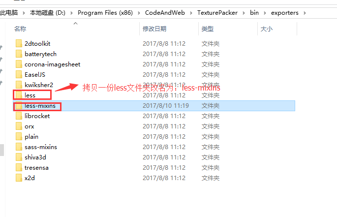

对于web开发人员来说，经常会处理网站上的小图标。为了减少请求次数和提高加载速度，把小图标合并成一张大图，然后利用相关技术呈现需要的图标部分。目前市面上最常用的小图标解决方案有以下两种：

 - 图标字体 （svg sprite)
 - 雪碧图（css sprite）

图标字体，不作为今天的讨论范围。今天主要探讨下雪碧图的基本原理和常见的几种实现方案，并最后给出笔者认为比较高效的雪碧图开发流程。

-------------------

## 什么是雪碧图
雪碧图是一种css图像合成技术，通过css的`background-image`（为元素设置背景图像）和`background-position`（设置背景图像的起始位置）属性显示需要显示的图片部分。
假如我们把四个图标在Photoshop里面排列成下图所示并导出成一张合并的大图（icons.png).



那么通过css样式定位的时候的坐标系是:外层块元素的左上角为（0，0）点，向右是x轴正向，向下是y轴正向。由于`background-position` 的作用是设置背景图像的起始位置，默认起始坐标是（0，0），如果想要只显示图中从左边起第二个绿色的图标，那么我们需要把整个背景图片向左偏移60像素，并设置整个块元素的尺寸为绿色图标大小,关键样式如下：
```
background-image: url("icons.png");
background-position: -60px 0px;
width:50px;
height:50px;
```
由此可见，实现雪碧图的关键有两个：

 - 打包成合并的大图；
 - 根据每个小图标在大图的位置形成css的坐标和尺寸的配置文件；

下面就来探讨下实现以上技术的几种方案。

----------

## 方案一：Photoshop手动拼图

如下图所示，我们把所有需要打包的图标拖入Photoshop编辑器，然后手动排版好。利用标尺和参考线获取每个图标的坐标和大小，也可以选中具体图标图层，使用快捷键ctrl+T弹出信息面板查看图层信息。最后再根据坐标信息编写对应的样式文件。
合并的大图文件（icons.png)


对应的样式文件（icons.css)如下：

```
.icon1{
    background-image: url("icons.png");
    background-position: 0px 0px;
    width:50px;
    height:50px;
}
.icon2{
    background-image: url("icons.png");
    background-position: -60px 0px;
    width:50px;
    height:50px;
}

.icon_mobile{
    background-image: url("icons.png");
    background-position: -114px -10px;
    width:26px;
    height:32px;
}

.icon_pc{
    background-image: url("icons.png");
    background-position: -156px -10px;
    width:32px;
    height:30px;
}
```
**优点**

 - 使用psd文件，可重复编辑图标；
 - 手写的css文件可以很灵活的加入任意其他属性；
 - 手写可以支持任意的样式类型（css、less、sass、scss)；

**缺点**

 - 增加，删除，更新图标麻烦；
 - 手动获取坐标效率低下，不准确；
 - 导出合并大图的尺寸有很多空白区域，并不是最优拼合；
 -  对开发者的ps使用有一定要求；
 - 导出的合并大图图片质量控制不够灵活（压缩等）；

----------

## 方案二：TexturePacker打包+less\sass\scss混合+koala（推荐）

### 工具介绍

[TexturePacker](https://www.codeandweb.com/texturepacker "TexturePacker") 是一个优秀的纹理打包工具，可以根据散图打包成大图并生成对应的小图标坐标尺寸等配置信息。现在被很多游戏开发团队广泛使用，用于构建丰富的逐帧动画角色和特效动画等。这个工具功能很全很强大，这儿简单介绍下它的几个特点：

 - 支持的框架和导出的格式丰富（支持css、less、sass及其他格式）；
 - 强大的[自定义格式](https://www.codeandweb.com/texturepacker/documentation#customization "自定义格式")导出（默认提供的格式不够用可以自己造）；
 - 导出图片的格式丰富（可根据需求选择更适合的图片格式，比如RGBA4444格式比RGBA8888格式的图片体积小接近一半）；
 - 支持命令行操作（方便和其他自动打包流程集成）；

[Koala](http://koala-app.com/index-zh.html "koala") 是一个前端预处理器语言图形编译工具，支持Less、Sass、Compass、CoffeeScript，帮助web开发者更高效地使用它们进行开发。跨平台运行，完美兼容windows、linux、mac。

### TexturePacker雪碧图制作

为了方便说明，我们新建一个简单的Html项目`SpriteSheetDemo`作为演示（以下说到的相对目录都是相对于项目`SpriteSheetDemo`的根目录而言） 其目录结构如下：


并默认认为你已经安装好了上面的两个工具：TexturePacker和koala。

**步骤一**

我们把所有需要打包成雪碧图的图标放在项目的`resource/icons`下面（实际项目建议根据不同功能模块归类图标到不同文件夹进行管理）


**步骤二**

打开TexturePacker，并拖入`resource/icons`的整个文件夹到TexturePacker中，如下图所示：


 1. 从左边的`Output`区域选择`Data Format`为`LESS (css)`；
 2. 点击工具栏的`Save`按钮，会弹出对话框让你选择保存导出配置的位置，我们保存在`resource/icons.tps`下面。工具会默认设置导出的大图和less文件到同级目录（`resource/icons.png`和`resource/icons.less`）；
 3. 我们分别点击`Output`区域的`Data file` 和 `Texture file` 修改导出目录到`src/style/sprite-sheet`目录下。
 4. 再次点击工具栏`Save`按钮；
 5. 其他的配置项可以根据个人需求选择，然后点击工具栏的`Publish`发布雪碧图大图icons.png和对应配置文件icons.less;
 


这样我们就非常简单的获得了雪碧图的合图和less配置文件，下面看下导出的icons.less文件长什么样：

```
//
// Created with TexturePacker http://www.codeandweb.com/texturepacker
//
// SmartUpdateHash: $TexturePacker:SmartUpdate:be14779bf468d72868854392203de820$
//

.sprite-icons { display:inline-block; overflow: hidden; background-repeat: no-repeat; background-image: url('icons.png'); }

.icons-ipad_hover { width: 26px; height: 32px; background-position: -36px -70px; }
.icons-ipad_normal { width: 26px; height: 32px; background-position: -36px -36px; }
.icons-ipad_selected { width: 26px; height: 32px; background-position: -36px -2px; }
.icons-pc_hover { width: 32px; height: 30px; background-position: -2px -66px; }
.icons-pc_normal { width: 32px; height: 30px; background-position: -2px -34px; }
.icons-pc_selected { width: 32px; height: 30px; background-position: -2px -2px; }
```
按理说到此为止我们就可以使用以上icons.less在项目中进行开发了。但是我发现目前生成的并不是less混合文件，特别是同一个图标（如ipad）的不同状态（normal,hover,selected)切换不是很好处理。这儿我们便利用到TexturePacker的自定义导出格式，我们自定义一个less-mixins的导出格式，以满足我们的要求。自定义导出格式的详细操作说明可以[参考文档](https://www.codeandweb.com/texturepacker/documentation#customization "自定义导出格式")；

### less-mixins自定义导出格式

 1. 进入到`TexturePacker`安装目录下的的exporters目录如：`D:\Program Files (x86)\CodeAndWeb\TexturePacker\bin\exporters`；
 2. 拷贝`less`文件夹到同级目录并改名为`less-mixins`;
 3. 进入到`less-mixins`目录，修改其中的`exporter.xml`为如下所示:
 

```
<exporter version="1.0">
    <!-- identifier of the exporter -->
    <name>less-mixins</name>
	
    <!-- display name of the exporter for the combo box -->
    <displayName>LESS-mixins (css)</displayName>
	
    <!-- description of the exporter -->
    <description>Creates a LESS mixins file that can be incorporated into a sprites arrangement</description>

    <!-- exporter version -->
    <version>1.0</version>
	
    <!-- currently only one file allowed - more to come with update -->
    <files>
        <file>
            <!-- name of this file variable -->
            <name>less</name>

            <!-- human readable name (for GUI) -->
            <displayName>LESS file</displayName>

            <!-- file extension for the file -->
            <fileExtension>less</fileExtension>

            <!-- name of the template file -->
            <template>sprites.less</template>
        </file>
    </files>

    <!-- target framework supports trimming -->
    <supportsTrimming>true</supportsTrimming>

    <!-- target framework supports rotated sprites -->
    <supportsRotation>false</supportsRotation>

    <!-- rotated sprites direction (cw/ccw) -->
    <rotationDirection>cw</rotationDirection>

    <!-- supports npot sizes -->
    <supportsNPOT>true</supportsNPOT>

    <!-- supports file name stripping (remove .png etc) -->
    <supportsTrimSpriteNames>yes</supportsTrimSpriteNames>

    <!-- supports texture subpath -->
    <supportsTextureSubPath>no</supportsTextureSubPath>

</exporter>


```

 4.修改`sprites.less`文件为如下所示：
 

```
//
// Created with TexturePacker, Don't edit this less mixins file.
// Author: txiejun
// Contact:txiejun@126.com
// SmartUpdateHash: {{smartUpdateKey}}
//

.d-{{texture.trimmedName}}() { display:inline-block; overflow: hidden; background-repeat: no-repeat; background-image: url('./sprite-sheet/{{texture.fullName}}'); }

.{{texture.trimmedName}}-{{sprite.trimmedName|makecssselector}}() { width: {{sprite.frameRect.width}}px; height: {{sprite.frameRect.height}}px; background-position: -{{sprite.frameRect.x}}px -{{sprite.frameRect.y}}px; }

```
5.关闭之前打开的`TexturePacker`界面，进入并双击`resource/icons.tps`文件，会自动打开`TexturePacker`界面；
6.从左边的`Output`区域选择`Data Format`的下拉框会发现新增了我们刚才自定义的导出格式：`LESS-mixins (css)`；

7.选中`LESS-mixins (css)`选项并点击工具栏的`Save`按钮，然后点击工具栏的`Publish`按钮重新发布；
重新生成的自定义icons.less雪碧图配置文件如下：

```
//
// Created with TexturePacker, Don't edit this less mixins file.
// Author: txiejun
// Contact:txiejun@126.com
// SmartUpdateHash: $TexturePacker:SmartUpdate:9234b80f33e9d89246acc0adce0c8ad8$
//

.d-icons() { display:inline-block; overflow: hidden; background-repeat: no-repeat; background-image: url('./sprite-sheet/icons.png'); }

.icons-ipad_hover() { width: 26px; height: 32px; background-position: -36px -70px; }
.icons-ipad_normal() { width: 26px; height: 32px; background-position: -36px -36px; }
.icons-ipad_selected() { width: 26px; height: 32px; background-position: -36px -2px; }
.icons-pc_hover() { width: 32px; height: 30px; background-position: -2px -66px; }
.icons-pc_normal() { width: 32px; height: 30px; background-position: -2px -34px; }
.icons-pc_selected() { width: 32px; height: 30px; background-position: -2px -2px; }
```
下面就通过项目`SpriteSheetDemo`演示下如何使用生成的雪碧图。

### 雪碧图的使用

**步骤一**
在`src/style`目录新建样式文件`app-less.less`,具体内容如下：

```
/**
* Author: txiejun
* Contact:txiejun@126.com
* Time: 2017/8/17 19:27
*/
//app 样式定义

@import "sprite-sheet/icons.less";

.d-app{
  height:500px;

  .tab-list{
    margin:10px 50px;

    .tab-item{
      display: inline-block;
      vertical-align: middle;
      text-align: left;
      font-size: 14px;
      margin-right:20px;
      padding:4px;
      border-radius:6px;
      border:1px solid #B6C2F6;

      .item-icon{
        float: left;
      }

      p{
        float: left;
        color: #333;
        line-height: 32px;
        height:32px;
        margin:0 5px;
      }

      //普通状态
      .icon-pc{
        .d-icons();
        .icons-pc_normal();
      }

      .icon-ipad{
        .d-icons();
        .icons-ipad_normal();
      }

      //hover状态
      &:hover{
        p{
          color: #dd2222;
        }

        .icon-pc{
          .icons-pc_hover();
        }

        .icon-ipad{
          .icons-ipad_hover();
        }
      }

      //选中状态
      &.selected{
        p{
          color: #39cc11;
        }

        .icon-pc{
          .icons-pc_selected();
        }

        .icon-ipad{
          .icons-ipad_selected();
        }
      }
    }
  }
}
```

**要点说明**

 - 在头部引入雪碧图样式文件`@import "sprite-sheet/icons.less";`
 - 使用一个小图标（如icon_pc),只需要按照如下进行定义（这儿用到了less的混合功能）：

```
.icon-pc{
  .d-icons();
  .icons-pc_normal();
}
```
因为我们在样式里面使用的是小图标的less变量`.icons-pc_normal()`，所以后续增加或者删除部分图标而不会影响其他图标的使用。

**步骤二**
启动`koala`软件，把`src/style`目录拖入`koala`主界面，如下所示。点击`refresh`或者选中其中的less文件，点击`compile`就会生成对应的css文件。


**步骤三**
在`src`目录下新建app.js文件，相关内容如下：

```
/**
 * Author: txiejun
 * Contact:txiejun@126.com
 * Time: 2017/8/17 17:32
 */
//demo入口

$(function () {
    var selectedTab = null;
    $(".tab-item").on("click", function (evt) {
        if(evt.currentTarget!=selectedTab){
            if(selectedTab){
                $(selectedTab).removeClass("selected");
            }
            selectedTab = evt.currentTarget;
            $(selectedTab).addClass("selected");
        }
    })
})
```
**要点说明**

 - `app.js`主要做了一件事：当用户点击不同tab的时候进行选中切换；

**步骤四**
在项目根目录新建`index.html`,相关内容如下：

```
<!DOCTYPE html>
<html lang="en">
	<head>
		<meta charset="UTF-8">
		<title>雪碧图演示</title>
		<meta name="renderer" content="webkit">
		<link rel="stylesheet" href="./src/style/app-less.css">
	</head>
	<body>
		<div class="d-app">
			<div class="tab-list">
				<a href="javascript:;" class="tab-item J_pc">
					<i class="item-icon icon-pc"></i>
					<p>电脑</p>
				</a>
				<a href="javascript:;" class="tab-item J_ipad">
					<i class="item-icon icon-ipad"></i>
					<p>iPad</p>
				</a>
			</div>
		</div>
		<script type="text/javascript" src="./src/libs/jquery-3.2.1.js"></script>
		<script type="text/javascript" src="./src/app.js"></script>
	</body>
</html>
```
**要点说明**

 - `index.html`构建了一个简单的网页，实现了一个tab列表的展示，我们在这儿通过`<link rel="stylesheet" href="./src/style/app-less.css">`引用了刚才*步骤二*通过`koala`生成的`app-less.css`文件。

**启动项目**
本项目需要安装Node.js和npm相关环境，在此默认认为你已经安装好相关环境。
 1. 进入`SpriteSheetDemo`项目根目录，执行命令`npm install http-server -g`；
 2. 执行命令`npm start`启动项目服务；
 3. 在浏览器输入：`http://localhost/`，如果不出意外将会展示如下内容：
 


**要点说明**

 - 鼠标晃到其中一个tab项上会变成红色，选中其中一个tab项会变成绿色；

到此一个通过`TexturePacker`进行雪碧图开发的流程就结束了。

**优点**

 - 灵活可扩展-支持多种样式类型（css、less、sass、scss)；
	 - 自定义格式功能支持任意格式导出；
	 - 通过koala辅助可以导出css文件，能够支持各种形式的项目架构；
 - 增加、删除、更新图标方便快捷；
	 - 只需要通过**资源管理器**更新`resource/icons`目录下面对应的图标，重新双击`resource/icons.tps`文件启动`TexturePacker`，便会自动更新打包的图标列表，点击工具栏的`Publish`导出即可。
 - 可以自动导出合图和小图标坐标配置，大大提高了开发效率；
 - 使用门槛低；
 - 耦合度低；
 - 导出图片格式和质量的控制非常灵活；
 - 根据算法导出最优的图片排列和尺寸，小图标之间排列非常紧凑；


----------

## 方案三：gulp.spritesmith/webpack-spritesmith（待研究）

[gulp.spritesmith](https://www.npmjs.com/package/gulp.spritesmith "gulp.spritesmith") 通过gulp自动化工具把图片集合转换成雪碧图和css、sass、less混合等配置；

[webpack-spritesmith](https://www.npmjs.com/package/webpack-spritesmith "webpack-spritesmith") 把图片集合转换为雪碧图和css、sass、less混合等配置的webpack插件，主要灵感来源于`gulp.spritesmith`；

具体的使用方法可以直接参考官方文档，在此就不进行详细叙述了（其实是还没深入研究）；

**优点**

- 上面两个工具都需要和具体的项目进行集成；
- 和方案二一样可以自动导出合图和对应的坐标配置；
- 结合自动化打包工具，可以更加方便；

**缺点**

 - 需要学习gulp或者webpack相关自动化构建的知识体系，使用门槛相对较高；
 - 应用场景和框架结合紧密；


## 总结

以上三个方案是笔者目前为止所了解到的最常见的雪碧图实现方案。

 - 方案一相对比较传统低效；
 - 方案二高效灵活扩展性强，是目前比较推荐的方案；
 - 方案三也是非常的高效，但是需要和自动化构建框架结合使用，使用门槛相对较高，如果能很好和现有开发框架结合，也不失为一种不错的解决方案。

如果还有其他更优秀的雪碧图解决方案，欢迎补充；

[演示项目地址下载](https://github.com/txiejun/SpriteSheetDemo "SpriteSheetDemo")